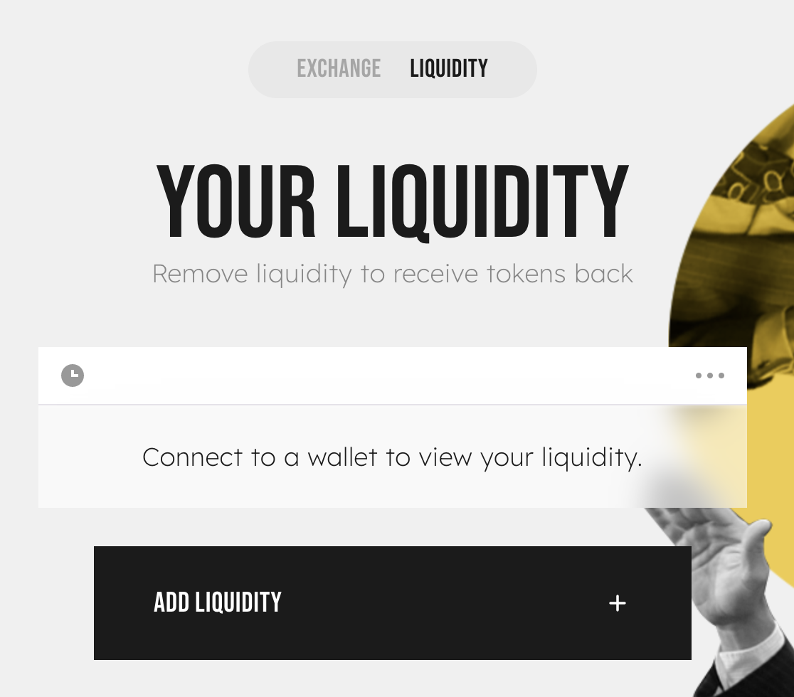

# Troubleshooting Errors

Sometimes you may find yourself facing a problem that doesn't have a clear solution. These troubleshooting tips may help you solve problems you run into.

## **Issues on the Exchange**

### **INSUFFICIENT\_OUTPUT\_AMOUNT**

> The transaction cannot succeed due to error: WolfRouter: INSUFFICIENT\_OUTPUT\_AMOUNT. This is probably an issue with one of the tokens you are swapping.
>
> the transaction cannot succeed due to error: execution reverted: wolfrouter: insufficient\_output\_amount.

You're trying to swap tokens, but your slippage tolerance is too low or liquidity is too low.



1. Refresh your page and try again later.
2. Try trading a smaller amount at one time.
3. Increase your slippage tolerance:
   1. Tap the settings icon on the liquidity page.
   2. Increase your slippage tolerance a little and try again. 
4. Lastly, try inputting an amount with fewer decimal places.



**This usually happens when trading tokens with low liquidity.**

That means there isn't enough of one of the tokens you're trying to swap in the Liquidity Pool: it's probably a small-cap token that few people are trading.

However, there's also the chance that you're trying to trade a scam token which cannot be sold. In this case, WolfSwap isn't able to block a token or return funds.



### **INSUFFICIENT\_A\_AMOUNT or INSUFFICIENT\_B\_AMOUNT**

> Fail with error 'WolfRouter: INSUFFICIENT\_A\_AMOUNT'\
> or\
> Fail with error 'WolfRouter: INSUFFICIENT\_B\_AMOUNT'

You're trying to add/remove liquidity from a liquidity pool (LP), but there isn't enough of one of the two tokens in the pair.



**Refresh your page and try again, or try again later.**

Still doesn't work?

1. Tap the settings icon on the liquidity page.
2. Increase your slippage tolerance a little and try again.




The error is caused by trying to add or remove liquidity for a liquidity pool (LP) with an insufficient amount of token A or token B (one of the tokens in the pair).

It might be the case that prices are updating too fast when and your slippage tolerance is too low.




OK, so you're really determined to fix this. We really don't recommend doing this unless you know what you're doing.

There currently isn't a simple way to solve this issue from the WolfSwap website: you'll need to interact with the contract directly. You can add liquidity directly via the Router contract, while setting amountAMin to a small amount, then withdrawing all liquidity.

#### **Approve the LP contract**

Head to the contract of the LP token you're trying to approve.\
For example, here's the ETH/TLOS pair:&#x20;

1. Select **Write Contract**, then **Connect to Web3** and connect your wallet. 
2. In **section "1. approve",** approve the LP token for the router by entering
   1. spender (address): enter the contract address of the LP token you're trying to interact with
   2. value (uint256): -1

#### Query "balanceOf"

1. Switch to **Read Contract.**
2. In **5. balanceOf**, input your wallet address and hit **Query**.
3. Keep track of the number that's exported. It shows your balance within the LP in the uint256 format, which you'll need in the next step.

.png>)

#### Add or Remove Liquidity

Head to the router contract:&#x20;

1. Select **Write Contract** and **Connect to Web3** as above.
2. Find **addLiquidity** or **removeLiquidity** (whichever one you're trying to do)
3. Enter the token addresses of both of the tokens in the LP.
4. In **liquidity (uint256),** enter the uint256 number which you got from "balanceOf" above.
5. Set a low **amountAMin** or **amountBMin**: try 1 for both.
6. Add your wallet address in **to (address)**.
7. Deadline must be an epoch time greater than the time the tx is executed.

.png>)


This can cause very high slippage, and can cause the user to lose some funds if frontrun




### WolfRouter: EXPIRED

> The transaction cannot succeed due to error: WolfRouter: EXPIRED. This is probably an issue with one of the tokens you are swapping.

Try again, but confirm (sign and broadcast) the transaction as soon as you generate it.

This happened because you started making a transaction, but you didn't sign and broadcast it until it was past the deadline. That means you didn't hit "Confirm" quickly enough.

### Wolf: K

> The transaction cannot succeed due to error: Wolf: K. This is probably an issue with one of the tokens you are swapping.

Try modifying the amount on “To” field. Therefore putting "(estimated)" symbol on “From”. Then initiate the swap immediately.

This usually happen when you are trying to swap a token with its own fee.

### Wolf: TRANSFER\_FAILED

> The transaction cannot succeed due to error: execution reverted: Wolf: TRANSFER\_FAILED.

Make sure you have 30% more tokens in your wallet than you intend to trade, or try to trade a lower amount. If you want to sell the maximum possible, try 70% or 69% instead of 100%.\
Caused by the design of Restorative Rebase tokens like tDoge or tBTC.\
[Understand how restorative rebase tokens work](https://btcst.medium.com/stp-8-restorative-rebase-b4fbbdfd96c).

Another possible cause of this issue is the malicious token issuer just suspended the trading for their token. Or they made selling action only possible for selected wallet addresses. Please always do your own research to avoid any potential fraud. If the token you are trying to swap but failed with this error code is coming from an airdrop, that is most likely a scam. Please do not perform any token approval or follow any links, your fund may be at risk if you try to do so.

### Transaction cannot succeed

Try trading a smaller amount, or increase slippage tolerance via the settings icon and try again. This is caused by low liquidity.

### **Price Impact too High**

Try trading a smaller amount, or increase slippage tolerance via the settings icon and try again. This is caused by low liquidity.

### estimateGas failed

> This transaction would fail. Please contact support



**If you got this error while removing liquidity from a TLOS pair:**

Please select "Receive WTLOS" and retry.

**If you got this error while trying to swap:**

Please contact the project team of the token you're trying to swap. \*\*\*\* This issue must be resolved by the project team.



**This issue (while swapping) is caused by tokens which have hard-coded the V1 WolfSwap router into their contract.**

While this practice is ill-advised at best, the reason for these projects having done this appears to be due to their tokenomics, in which each purchase sends a % of the token to LPs.

The projects affected will likely not work with the V2 router: they will most likely need to create new versions of their tokens pointing to our new router address, and migrate any existing token holders to their new token.

We recommend that any projects which created such tokens should also make efforts to prevent their users from adding them to V2 LP.

The up-to-date router address is <>



### Cannot read property 'toHexString' of undefined

> "Unknown error: "Cannot read property 'toHexString' of undefined"

When trying to swap tokens, the transaction fails and this error message is displayed. This error has been reported on mobile devices using Trust Wallet.



1. Attempt the transaction again with increased slippage allowance.
2. If 1. does not resolve your problem, consider using another wallet such as SafePal for your transaction.



**This usually happens when trading tokens with insufficient slippage allowance on Trust Wallet.**

The exact details of the problem are still being investigated.



### **Execution reverted: TransferHelper: TRANSFER\_FROM\_FAILED.**

> The transaction cannot succeed due to error: execution reverted: TransferHelper: TRANSFER\_FROM\_FAILED.

When trying to swap tokens, the transaction fails and this error message is displayed. This error has been reported across platforms.



1. Check to make sure you have sufficient funds available.
2. Ensure you have given the contract allowance to spend the amount of funds you're attempting to trade with.



This error happens when trading tokens with insufficient allowance, or when a wallet has insufficient funds.\
If you're trading tokens with Restorative Rebase like tau assets tDoge or tBTC, make sure you understand how they work first with this [guide to Rebase tokens](https://btcst.medium.com/stp-8-restorative-rebase-b4fbbdfd96c).



## **Issues with Lude Pools**

### TLOS: burn amount exceeds balance

> Fail with error 'TLOS: burn amount exceeds balance'

You don't have enough LUDE in your wallet to unstake from the WOLF-WOLF pool.

**Get at least as much LUDE as the amount of WOLF that you’re trying to unstake.**

1. Buy LUDE on the exchange. If you want to unstake 100 WOLF, you need at least 100 LUDE.
2. Try unstaking again.

If that still fails, you can perform an “emergencyWithdraw” from the contract directly to unstake your staked tokens.

1. Go to:&#x20;
2. Click **“Connect to Web3”** and connect your wallet. 
3. In section **“4. emergencyWithdraw”**, enter "0" and click “Write”.

This will unstake your staked tokens and lose any uncollected WOLF yield.


**This will lose any yield that you haven’t harvested yet.**


To stop this happening again, **don’t sell your LUDE.** You still need it to unstake from the “Stake WOLF, Earn WOLF” pool.

This error has happened because you have sold or transferred LUDE tokens. LUDE is minted in a 1:1 ratio to WOLF when you stake in the WOLF-WOLF Lude Pool. LUDE must be burned at a 1:1 ratio to LUDE when calling leaveStaking (unstaking your WOLF from the pool), so if you don't have enough, you can't unstake from the pool.





### Out of Gas error

> Warning! Error encountered during contract execution \[out of gas]

You have set a low gas limit when trying to make a transaction.



Try manually increasing the **gas limit** (not gas price!) in your wallet before signing the transaction.

A limit of 1000 is usually enough.

.png>)

The above example is from Metamask; check your wallet's documentation if you aren't sure how to adjust the gas limit.



Basically, your wallet (Metamask, Trust Wallet, etc.) can't finish what it's trying to do.

Your wallet estimates that the gas limit is too low, so the function call runs out of gas before the function call is finished.



### TLOS: transfer amount exceeds allowance

> Fail with error 'TLOS: transfer amount exceeds allowance'



1. Use Unrekt.net to revoke approval for the smart contract you're trying to interact with
2. Approve the contract again, without setting a limit on spend allowance
3. Try interacting with the contract again.



This happens when you set a limit on your spend allowance when you first approved the contract, then try to swap more than the limit.



### TLOS: transfer amount exceeds balance

> Fail with error 'TLOS: transfer amount exceeds balance'

You're probably trying to unstake from a Lude Pool with low rewards in it. Solution below.

If not, you may be trying to send tokens that you don't have in your wallet (for example, trying to send a token that is already assigned to a pending transaction). In this case, just make sure you have the tokens you're trying to use.



Firstly,[ let the team know](../contact-us/telegram.md) which pool you're trying to unstake from, so they can top up the rewards. If you're in a hurry to unstake and you don't mind losing your pending yield, try an emergencyWithdraw:

You can perform an “emergencyWithdraw” from the contract directly to unstake your staked tokens.

1. Find the contract address of the Lude Pool you're trying to unstake from. You can find it in your wallet's transaction log.
2. Go to https://teloscan.com/ and in the search bar, enter the contract address.
3. Select **Write Contract.**
4. Click **“Connect to Web3”** and connect your wallet.
5. In section **“4. emergencyWithdraw”,** enter "0" and click “Write”.

This will unstake your staked tokens and lose any uncollected yield.


**This will lose any yield that you haven’t harvested yet.**




This error tends to appear when you're trying to unstake from an old Lude Pool, but there aren't enough rewards in the pool left for you to harvest when withdrawing. This causes the transaction to fail.



## **Other issues**

### Unsupported Chain ID

Switch your chain to the Telos Native Chain (ID 40). Check your wallet's documentation for a guide if you need help.

