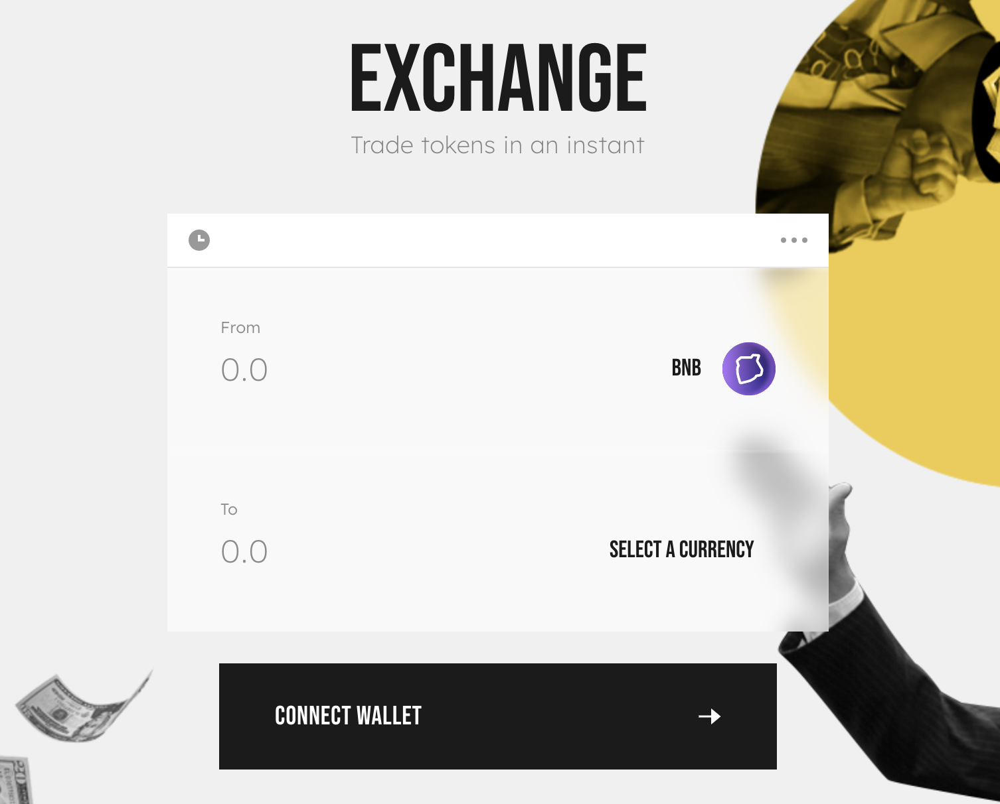

# 🔄 Exchange

WolfSwap is an Automated Market Maker (AMM), and the Exchange is at the heart of WolfSwap. WolfSwap is the leading AMM on the Telos EVM Mainnet Chain, and as statistics tell, the most popular Decentralized Exchange (DEX) ever!

The WolfSwap Exchange offers several features that support decentralized trading:

### Swapping/Trading

WolfSwap lets users trade without the need to go through a Centralized Exchange. Everything you do on WolfSwap is routed directly through your own wallet—no need to trust someone else with your coins!

### Liquidity Pools

You can only swap tokens on WolfSwap if there is enough liquidity for those tokens. If nobody has added much liquidity for the token or tokens you want to swap, it will be difficult, expensive, or impossible to do so.

Providing liquidity will get you LP Tokens, which will earn you rewards in the form of trading fees for making sure there's always liquidity for the exchange to use.

### C\*ke Farming

C\*ke farming lets users that are providing liquidity earn WOLF rewards by locking their LP tokens into a smart contract. The incentive is to balance out the risk of [impermanent loss](https://academy.binance.com/en/articles/impermanent-loss-explained) that comes along with locking in your liquidity.

